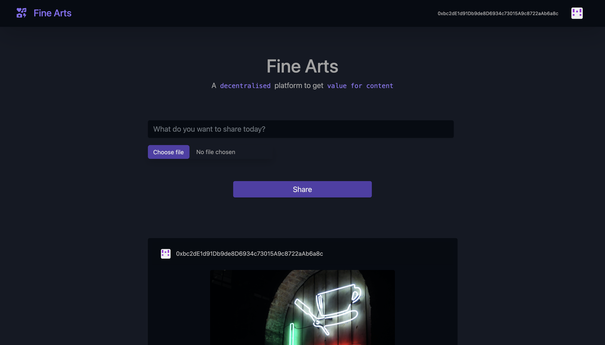

# Fine Arts

 

A decentralised platform where creators can get value for their content. They can post stuff while preserving their privacy and anonymity. So, only the content matters! Creators can post their images, songs, and videos. Only the best content will prevail. People can tip content based on whether they like it or not. The content appear based on the highest number of tips first. So, the system guarantees that the best content will be shown first and probably get tipped more.

The application is built using the ethereum blockchain.

 

<b>Technologies used</b>:

Solidity
JavaScript
Truffle
Ganache
ReactJS
Web3
Metamask
BootStrap
Chai
Identicon
